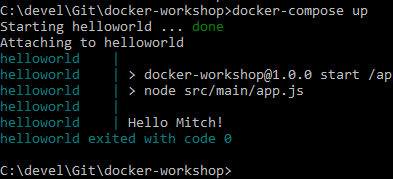
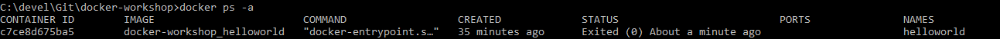

# Docker Workshop

## Helloworld through docker compose

Docker compose allows us to configure all the different parameters that we can from the command line through a file as well as allowing us to start up multiple services, that may depend upon each other.

### The docker-compose.yml file

The `docker-compose.yml` file is where define our infrastructure and configuration. Going through it line by line

```yml
version: '3'
```

Version of docker compose to use, the latest version is 3.7.

```yml
services:
```

This is the section under which we define our services, there are other sections but they are outside our scope.

```yml
helloworld:
```

This is the name of our 'service' (note that the container and service names can be different).

```yml
build: .
```

This is the location of our Dockerfile, in this case its in the current directory.

```yml
container_name: helloworld
```

The name of the container

```yml
environment:
  - NAME=Mitch
```

Lists environment name/value pairs.

### Running the container with docker compose

To run this run the command

```bash
docker-compose up
```

Should produce output like



Note how docker compose displays which app each of the lines of output is coming from.

Checking the list of existing containers with `docker ps -a`



Can see that docker compose created a `docker-workshop_helloworld` image (note how the image name by default is `<file directory>_<service name>`) and a container with the name that was defined in the `docker-compose.yml` file. The image name could also be defined like so

```yml
image: helloworld_image
```

placed at the same level as the `build` property.

### The .env file

Being able to automate all of this configuration is great and makes the commands needed to be typed from the command line very simple. At the moment we're defining which services we want to create and the configuration for those services within the same file. Ideally this should be decoupled, because often we will use the same infrastructure in multiple places (production, staging, dev, etc) but use different configuration (e.g. connecting to different endpoints).

This is where the `.env` file comes in. As it allows all of the environment variables to be defined in a separate file to the docker compose file, allowing us to separate our infrastructure from our configuration.

Create a new file `.env` at the same level as `docker-compose.yml` and add the following line

```bash
NAME=<your name>
```

Replace

```yml
environment:
  - NAME=...
```

with

```yml
env_file: .env
```

changing the value of `NAME` in the `.env` file will output different values from the command line.

## Running a service

Now that we can run the command line hello world app from docker compose, we are going to add to it to run it as a web service.

### Updating the code

Firstly, add the following lines to `.env`

```bash
PORT=8080
APP_NAME=helloworld
```

then add the following lines to `docker-compose.yml` under the `env_file` lines

```yml
ports:
  - $PORT:$PORT
```

The `ports` property allows us to expose ports from within the container to the local machine, in this case we're mapping onto the same port (8080 -> 8080), but we could easily map from any port to any other port.

Make the following changes to the `Dockerfile`:

after the other `ADD` lines

```Dockerfile
ADD ./package-lock.json /app/package-lock.json
```


and after the `WORKDIR` line

```Dockerfile
RUN npm install
```

This will download the dependency on `express` while the docker image is being built.

So the file should look like this

```Dockerfile
FROM node:10

ENV NAME "World"

ADD ./package.json /app/package.json
ADD /src /app/src
ADD ./package-lock.json /app/package-lock.json

WORKDIR /app

RUN npm install

CMD npm start
```

And finally, update `app.js` to the following

```javascript
const express = require('express')
const app = express()
const port = process.env.PORT
const name = process.env.NAME
const appName = process.env.APP_NAME

app.get('/', (req, res) => {
  console.log('Received GET request!')
  res.send(`Hello ${name}!`)
})

app.listen(port, () => console.log(`${appName} listening on port ${port}!`))
```

This will just send `Hello <name>!` back to the user when they send a HTTP `GET` request to `$PORT` (in this case 8080).

### Managing the service

To run the service

```bash
docker-compose up --build
```

We need to specify `--build` otherwise it will just use the existing image of helloworld. Alternatively we could do

```bash
docker-compose build
docker-compose up
```

Once the service is running, try going to `localhost:8080` in a browser.

You will notice that you can't type any commands and exiting (i.e. `Ctrl+C`) will cause the service to terminate.

To avoid this, in most cases you will want to run the service in detached mode. To do this add the flag `-d` to the command

```bash
docker-compose up --build -d
```

`docker ps` will allow us to see the service up and running.

To view the logs of the container use `docker logs <container name>`

To bring the service down use the command `docker-compose down`. Note how docker compose removes the container rather than just stopping it. To just stop the container use `docker-compose stop` - however this will prevent `docker-compose up` from running successfully and `docker-compose start` will need to be used instead. 

Generally `up/down` is preferred over `start/stop` as it allows the newest image to be pulled before running the container again. Generally the upgrade of a service will look like

```bash
docker-compose down
docker-compose pull
docker-compose up -d
```

optionally also with the `--build` flag if anything needs to be built locally, but ideally everything should be pulled from a remote artifactory.

Chane branch to `Stage3-communication` to continue.
