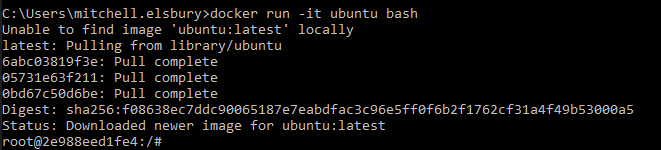
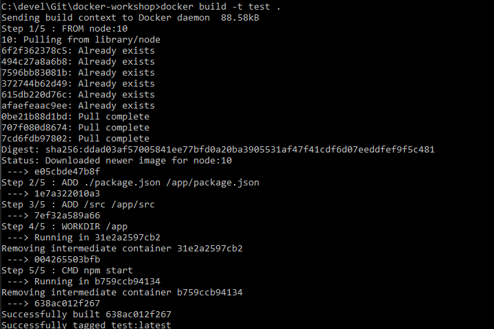
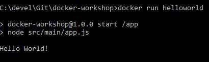

# Docker Workshop

## Images and Containers

### Running Ubuntu bash from the commandline

Run the command

`docker run -it --rm ubuntu bash`

Should produce output like



You can use this as you normally would with a bash terminal. But note that files on the local machine won't be accessible as this is being run inside a container which does not have access to the host machine.

Type `exit` as you normally would on a bash terminal to exit out of the container back to the normal commandline.

`docker run` has done a few things here. Firstly it checks to see if the image 'ubuntu' exists locally, if not it looks online for the image and pulls the latest version. Once the image is on the local machine docker runs the command `bash` inside the `ubuntu` image, giving us a bash terminal. The arguments `-it` allow us to run the bash in interactive mode - without them the container would just exit instantly because the `stdin` stream isn't open.

## Build our own images

There's a `app.js` file in `src/main` which just prints hello world. This can be run from the command line with the command `npm start`, but will require NodeJs to be installed. Having NodeJS installed is not required, in fact not having it installed will show the power of Docker.

### The Dockerfile

To run this file within a docker container we will need to build an image. Building an image is done with a `Dockerfile`.

Looking at the Dockerfile in this directory, there are a few things happening:

Firstly,

```Dockerfile
FROM node:10
```

This specifies the base image that we are using. In this case, NodeJS version 10. The image is basically just an ubuntu image with NodeJS version 10 installed on top (the NodeJS image probably uses the ubuntu image as its base image).

```Dockerfile
ADD ./package.json /app/package.json
ADD /src /app/src
```

This is copying files from outside of the image into the image. This allows us to copy only things that we need, making the image as light as possible.

Note that the files are being copied into the `/app` directory, this directory did not exist by default. `ADD` will create the directory if it doesn't exist. Ensure that the data is always copied into a directory other than the root directory (i.e. `/`) as this is bad practice.

```Dockerfile
WORKDIR /app
```

This shifts the working directory to `/app`. This is the same as calling `RUN cd /app`, where `RUN` runs a command at the time the image is being built. Using `RUN` in this way is considered bad practice though and `WORKDIR` should be preferred as it is considered a best practice.

```Dockerfile
CMD npm start
```

This runs the project. Unlike `RUN`, `CMD` is ran when the container is started and `npm start` is the command which is being run.

### Building the image

To build the image run the command

```bash
docker build --tag helloworld .
```

This will create an image with the name `helloworld`, from the Dockerfile in the current directory.

Output:



Similar to the `docker run` command, it checked to see if I had the `node:10` image locally, when if couldn't find it, it downloaded it from a public artifactory.

You can see that Docker creates a new 'intermediate' container for each 'step' or each line of the Dockerfile, these are called layers. When building this image for the second time, if the hash of given layer is the same it is not rebuilt. Try changing `app.js`, everything from `ADD /src /app/src` onwards will be rebuilt (Steps 3-5), but the lines above it won't (Steps 1-2).

### Running the image

```bash
docker run --rm helloworld
```

Should get



Now you know how to build and run a docker image! Now lets make that image more interesting.

### Environment variables

Environment variables are a large part of how configuration is done through Docker. They can be used to specify configuration such as endpoints of other application, the API version to use, which ports to listen on, which certificate(s) to load, etc.

In this simple example we're just going to change our program from outputting `Hello World` to `Hello <name>`, where `<name>` will be an environment variable.

To do this, first change the line in `app.js` to

```javascript
console.log('Hello ' + process.env.NAME + '!')
```

This will replace `process.env.NAME` with the value of the environment variable `NAME`.

Then between the `FROM` and `ADD` statements in the Dockerfile add the line

```Dockerfile
ENV NAME "World"
```

This specifies the environment variable `NAME`, giving is a default value of `"World"`.

Rebuild

```bash
docker build --tag helloworld .
```

Run

```bash
docker run --rm helloworld
```

Should see the same output `Hello World!`.

Now with specifying the value for `NAME`

```bash
docker run --rm -e NAME=Mitch helloworld
```

Output should be `Hello Mitch!`.

## Publishing Images

Some of the biggest benefits to Docker are the improvements that can be made to deployment and how to automate it. To do this we need to be able to put our image somewhere that is easily accessible from a build agent, staging environment, production environment, etc. Generally such a place to store binaries (not just docker images) is called an artifactory. For most publicly accessible docker images these are stored on DockerHub.

### Logging in

To publish the image, first you will need to login

```bash
docker login
```

By default if no artifactory url is specified as the third argument, DockerHub is the default

Use the login credentials you used to sign up when installing Docker.

### Publishing to DockerHub

Once you've logged in, tag your image as follows

```bash
docker tag helloworld <username>/<repo name>
```

Where `<username>` is your DockerHub username and `<repo name>` is the name of the repository you created at the beginning.

This will tag the image with the alias provided, using the command `docker images` you can see the image listed with the new tag.

### Pulling from DockerHub

Delete your image

```bash
docker rmi helloworld <username>/<repo name>
```

(might need to add `-f` to force it if you have any containers using it)

Then try pulling your image

```bash
docker pull <username>/<repo name>
```

Run

```bash
docker run --rm -e NAME=George <username>/<repo name>
```

Can also try pulling my image

```bash
docker run --rm -e NAME=example mitchhhh/helloworld
```

Note how `docker run` can be used without a local image, where docker will attempt to pull the image if it doesn't exit locally.

Once you've checkout the next branch - `Stage2-compose`
